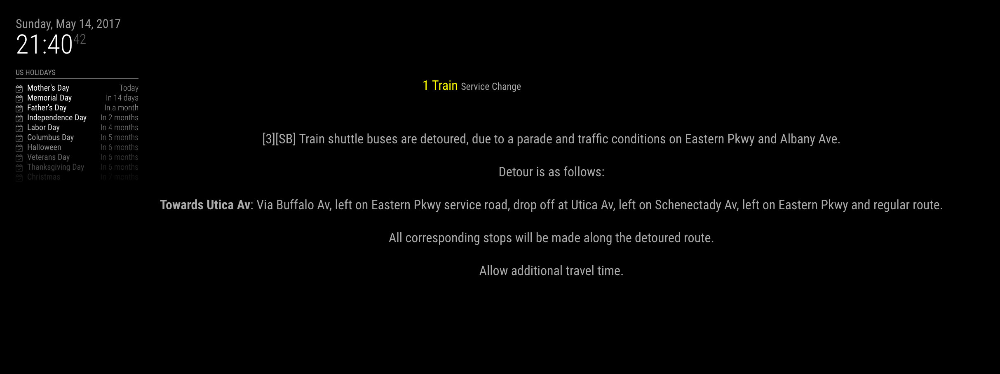

# MagicMirror MTA transit module

**Still under construction**

Requires [MTA gtfs](https://github.com/aamaliaa/mta-gtfs) node module:
```bash
 npm install
 ```

# Get API key

You need to obtain your API key here: http://datamine.mta.info/user/register


# Setup config file

```javascript
{
  module: "MMM-mta-transit",
  position: "top_right",
  config: {
    updateInterval: 30 * 60 * 1000, // Update 30 minutes.
    initialLoadDelay: 0,
    apiKey: "Get it from http://datamine.mta.info/user/register",   
    trainStatus: ['Q'], //the trains for which status should be displayed
    statusId: ['DELAYS', 'SERVICE CHANGE'], //or PLANNED WORK     
  }
},
```

Currently it only displays general delays and service changes and no real time data.
This is because I live on the Q Train and MTA does not yet provide real time data for most of Brooklyn.



The CSS needs work. Volunteers more than welcome.


